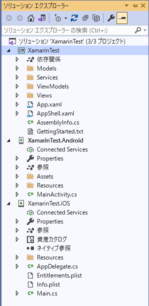
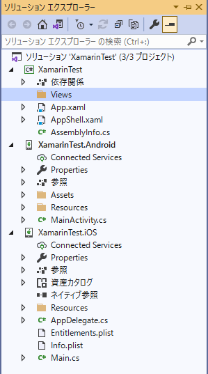
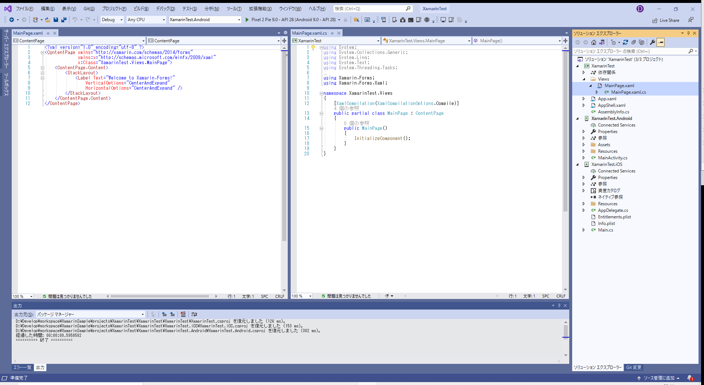
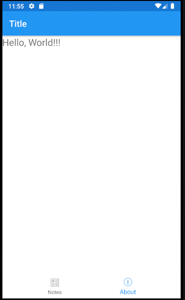
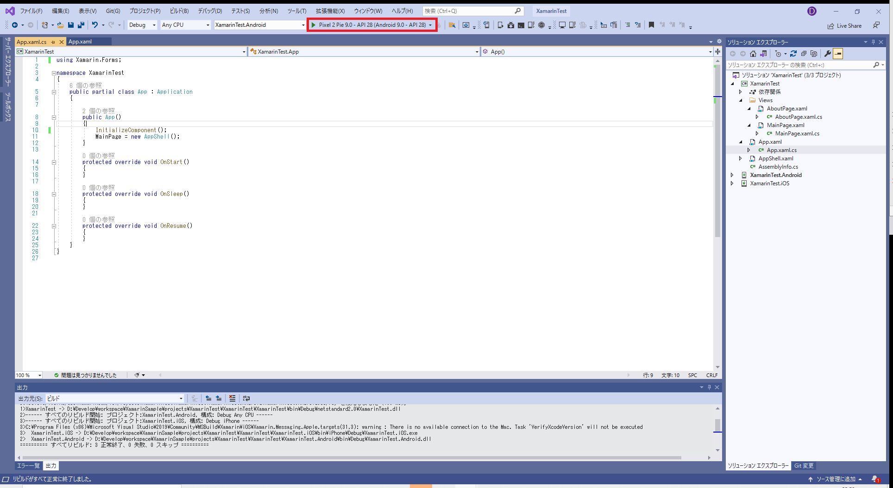
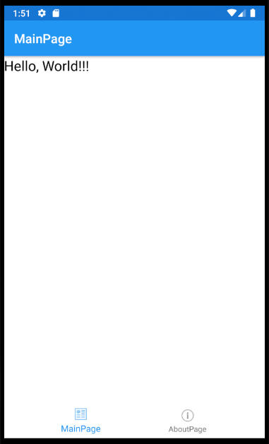
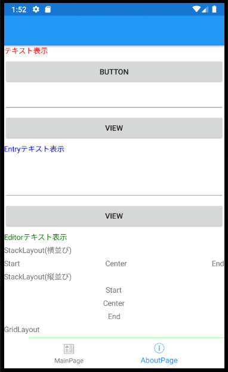

# 01. 新規プロジェクトの作成

## 1. プロジェクトの作成

新しいプロジェクトの作成  
⇒「モバイルアプリ(Xamarin.Forms)」を選択  
⇒プロジェクト名・保存場所の設定  
⇒「タブ付き」を選択。(今回は開発対象を「Android」「iOS」に設定。)

## 2. 不要なファイル・フォルダの削除

(プロジェクト名)の下にある以下のフォルダ・ファイルを削除  
- Modelsフォルダ
- Servicesフォルダ
- ViewModelsフォルダ  
- Viewsフォルダ  
- GettingStarted.txt  

## 3. Viewsフォルダの作成

(プロジェクト名)の下に「Views」フォルダの作成

## 4. コンテンツページの作成

### 4-1. Viewsフォルダに新しい項目の追加

[Visual C#アイテム]>[Xamarin.Forms]>[コンテンツページ]  
(コンテンツページ(C#)は違う。)

### 4-2. コンテンツの編集(MainPage)

#### 4-2-1. MainPage.xamlのコードを以下のように修正(MainPageのデザイン編集)

[コード](./01_4-2-1_MainPage.xaml)
  

#### 4-2-2. NotesPage.xaml.csのコードを以下のように修正(MainPageの動作を編集)

⇒新規作成から修正なし。

## 5. コンテンツページの作成(AboutPage)

### 5-1. Viewsフォルダに新しい項目の追加

[Visual C#アイテム]>[Xamarin.Forms]>[コンテンツページ]  
「AboutPage」を追加。

### 5-2. コンテンツの編集

#### 5-2-1. AboutPage.xamlのコードを以下のように修正(AboutPageのデザイン編集)

基本的なコントロールを記載しています。  
実行した際にすべての内容が表示されない場合は、必要箇所以外は削除して、内容を確認してください。

[コード](./01_5-2-1_AboutPage.xaml)

#### 5-2-2. AboutPage.xaml.csのコードを以下のように修正(AboutPageの動作を編集)

ボタンがおされた時の動作を記述。  
Onlickedなど、xamlに関数名を記載して、.csファイルにその定義をしていない場合はエラーになるため、注意してください。

[コード](./01_5-2-2_AboutPage.xaml.cs)

## 6. タブが押されたときに画面が遷移するように修正

### ・(プロジェクト名)/AppShell.xamlの内容を編集。

[コード](./01_6_AppShell.xaml)

### ・(プロジェクト名)/AppShell.xaml/AppShell.xaml.csの内容を編集。

[コード](./01_6_AppShell.xaml.cs)

## 7. App.xamlの編集

### ・(プロジェクト名)/App.xamlの内容を編集。

[コード](./01_7_App.xaml)

### ・(プロジェクト名)/App.xaml/App.xaml.csの内容を編集。

[コード](./01_7_App.xaml.cs)

## 8. ソリューションのリビルド

上部メニューの「ビルド」⇒「ソリューションのリビルド」

## 9. エミュレータまたは実機で実行

[エミュレータの設定方法](./02_CreateEmulator.md)  

  

   
 

[エミュレータの動作が遅い場合](https://docs.microsoft.com/ja-jp/xamarin/android/get-started/installation/android-emulator/hardware-acceleration?pivots=windows)

