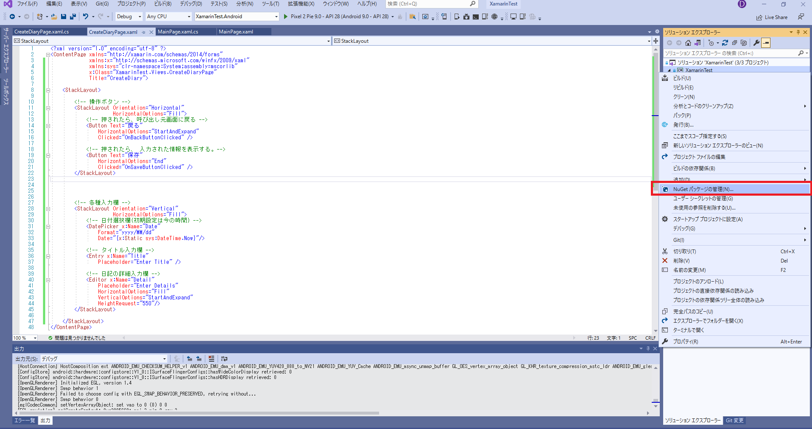
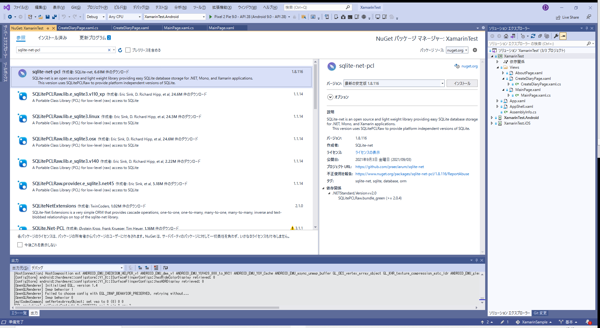
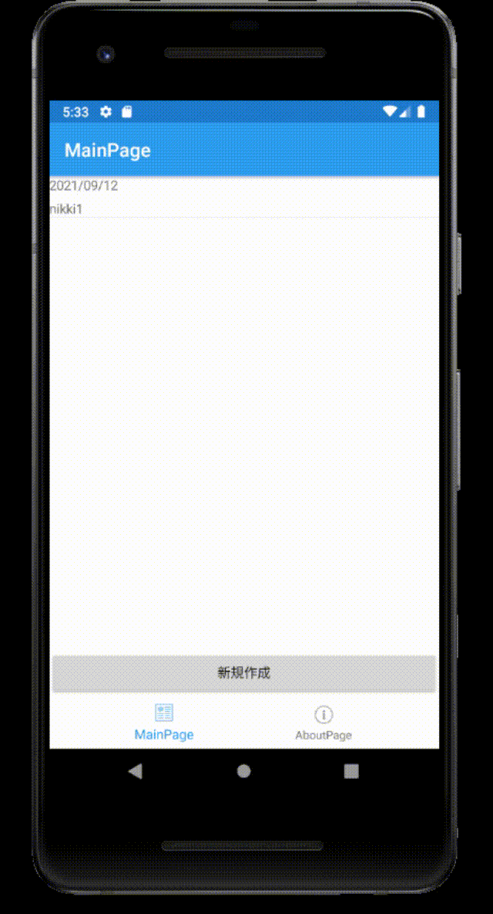
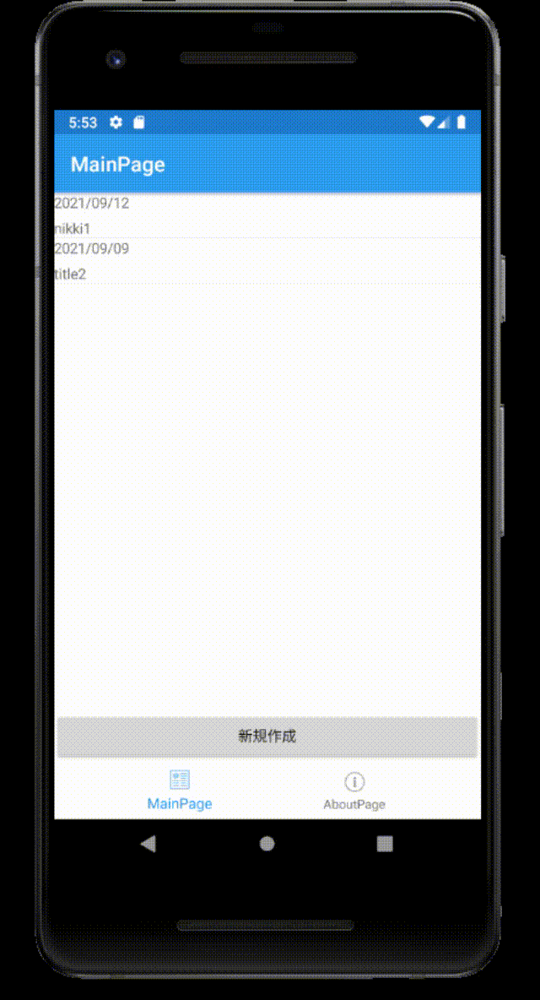
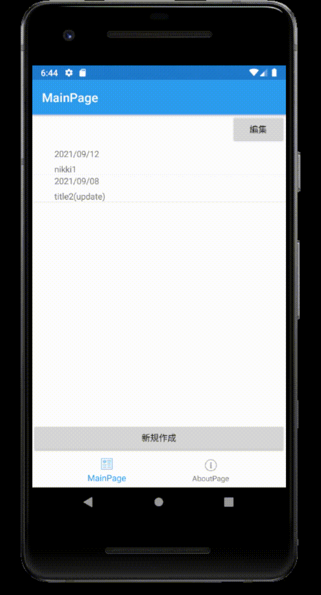

# 03. 日記アプリの基本部分

## 1. 画面遷移

### 〇概要
MainPageには今まで作成した日記の一覧を表示し、日記の新規作成は別画面で行う。
そこで、MainPageから日記作成画面への遷移を行う。

### 1-1. 日記作成画面を作成

[Visual C#アイテム]>[Xamarin.Forms]>[コンテンツページ]  
今回はコンテンツページ名は「CreateDiaryPage」とした。


### 1-2. CreateDiaryPageのコードの編集

CreateDiaryPageと表示されるだけの画面。  

- [CreateDiaryPage.xaml](./03/03_1-2_CreateDiaryPage.xaml)  
- CreateDiaryPage.xaml.csは修正なし。


### 1-3. MainPageのコードの編集

ボタンを押すことで、日記作成画面へ遷移するように変更。

- [MainPage.xaml](./03/03_1-3_MainPage.xaml)  
- [MainPage.xaml.cs](./03/03_1-3_MainPage.xaml.cs)  

#### 〇補足

- MainPage.xaml
```XML
        <Button Text="新規作成"
                VerticalOptions="EndAndExpand"
                Clicked="OnNewDiaryButtonClicked" />
```
クリックされた際、"OnNewDiaryButtonClicked"が呼び出される。

- MainPage.xaml.cs
```C#
        private void OnNewDiaryButtonClicked(object sender, EventArgs e)
        {
            Navigation.PushModalAsync(new CreateDiaryPage());
        }
```
Navigation.PushModalAsync()により、新規画面を呼び出すことができる。  
呼び出された画面では、「スマホ搭載の戻るボタンをクリック」または「Navigation.PopModalAsync()を実行」で元の画面に戻ることができる。

##### 参考：https://docs.microsoft.com/ja-jp/xamarin/xamarin-forms/app-fundamentals/navigation/modal


## 2. テキストの入力および入力した内容の取得

### 〇概要
ここでは、CreateDiaryPageを編集し、「テキストの入力フォームの作成」および「そのフォームに入力された内容の取得」ができるようにする。


### 2-1. CreateDiaryPageのデザインの設定

- [CreateDiaryPage.xaml](./03/03_2-1_CreateDiaryPage.xaml)  

#### 〇補足

- 日付選択欄
```XML
            <!-- 日付選択欄(初期設定は今の時間) -->
            <DatePicker x:Name="Date" 
                Format="yyyy/MM/dd"
                Date="{x:Static sys:DateTime.Now}"/>
```
DataPicker：日付を選択するコントロール。  
Formatで表示される形式を指定可能。  
また、Dateに指定された日付が表示されるが、初期では今の日付が表示されるように設定。  
⇒今の日付を表示させるには、「xmlns:sys="clr-namespace:System;assembly=mscorlib"」をContentPageタグの要素に追加する必要がある。
##### 参考：https://anderson02.com/cs/xamarin1/xamarin-30/


- タイトル入力欄・詳細入力欄  
タイトル入力欄は1行のみの入力のEntryタグを、詳細入力欄は複数行入力可能なEditorタグを使用。  
また、Placeholderで何も入力されていないときに表示されるテキストの設定が可能。


### 2-2. CreateDiaryPageの機能の設定

- [CreateDiaryPage.xaml.cs](./03/03_2-2_CreateDiaryPage.xaml.cs)  


#### 〇補足
- 入力されたテキストの取得
```C#
            // 入力されたテキストの取得
            DateTime dateTime = Date.Date;  // 日付（型：DateTime）
            string titleText = Title.Text;  // タイトル
            string detailText = Detail.Text;    // 詳細
```
xamlファイルの各コントロールで「x:Name」に指定された名前を用いることで、C#のコードから各コントロールの要素にアクセス可能。
⇒日付(Date)のDate要素、タイトル(Title)・詳細(Detail)のText要素にアクセスすることで、現在入力されている内容を取得可能。

- 入力された内容の表示
```C#
            // 入力された内容を表示
            var result = DisplayAlert(titleText, detailText +"\n\n日付:"+dateTime.ToString("yyyy/MM/dd"), "OK", "キャンセル");
```
DisplayAlert()：ポップアップのメッセージを表示する。  
    - 第1引数：タイトル  
    - 第2引数：内容  
    - 第3引数：OKボタンに表示するテキスト  
    - 第4引数：キャンセルボタンに表示するテキスト  
戻り値はOKが押されたらtrue、キャンセルが押されたらfalseが返る。  
(なお戻り値でプログラムを分岐させたい場合は、await演算子を用いるなど、プログラムを少し修正しなければならない。)

##### 参考：https://dev.classmethod.jp/articles/xamarin-forms-alert/


### 2-3. 実行結果

  


## 3. データベースの作成

### 3-1. sqlite-net-pclを追加

1. (ソリューション名)を右クリック⇒NuGetパッケージの管理を選択。



2. 参照を選択し、「sqlite-net-pcl」を検索。


3. 「インストール」を選択


### 3-2. データベースのテーブルを作成

1. (プロジェクト名)の下に「DB」フォルダの作成

2. DBフォルダ内に日記のデータベースのひな型を作成  
[Visual C#アイテム]>[クラス]  (Diaryを作成)    
[Diary.cs](./03/03_3-2_Diary.cs)  
⇒ DiaryId, Date, Title, Detailの4つで問題ないが、今後の拡張を考え、あらかじめ予備のデータ格納場所を用意する。

3. データベースを操作するクラスの作成
[Visual C#アイテム]>[クラス]  (DiaryDAOを作成)    
[DiaryDAO.cs](./03/03_3-2_DiaryDAO.cs)  


### 3-3. DB操作を追加

1. データベースを開くコードの追加(App.xaml.csを編集)  
[App.xaml.cs](./03/03_3-3_App.xaml.cs)  


2. DBへ保存するコードに修正  
[CreateDiaryPage.xaml.cs](./03/03_3-3_CreateDiaryPage.xaml.cs)


### 3-4. DBに追加されているデータをMainPageで表示する

1. MainPage.xamlを編集（デザインを編集）  
[MainPage.xaml](./03/03_3-4_MainPage.xaml)


2. MainPage.xaml.csを編集 (表示の直前にデータベースの情報を反映)   
[MainPage.xaml.cs](./03/03_3-4_MainPage.xaml.cs)


### 3-5. 実行結果




## 4. 過去の日記データを編集可能にする

### 4-1. 日記作成ページに過去の日記データが渡されたときの処理を追加
[CreateDiaryPage.xaml.cs](./03/03_4-1_CreateDiaryPage.xaml.cs)


### 4-2. 過去の日記データを選択されたときの処理を追加

- [MainPage.xaml](./03/03_4-2_MainPage.xaml)
- [MainPage.xaml.cs](./03/03_4-2_MainPage.xaml.cs)

### 4-3. 実行結果




## 5. 作成した日記データを削除する

### 〇概要

MainPageに編集ボタンを用意し、このボタンが押された場合、削除用のチェックボックスを表示する。  
このチェックボックスが選択された状態で、削除ボタンが押されると、チェックが入っているものが削除される。

### 5-1. MainPageの編集

[MainPage.xaml](./03/03_5-1_MainPage.xaml)  
[MainPage.xaml.cs](./03/03_5-1_MainPage.xaml.cs)  

### 5-2. 実行結果




