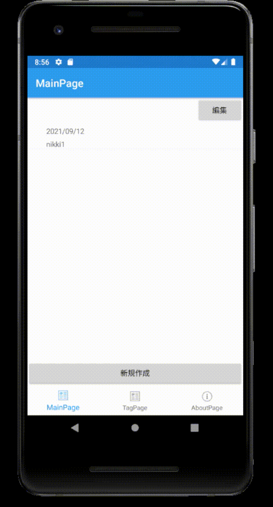
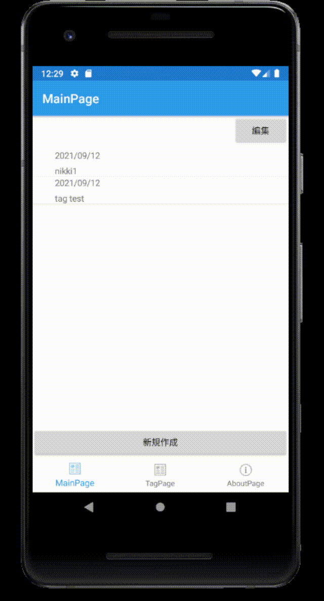

# 04. タグ機能

## 1. タグのDB作成
1. [Visual C#アイテム]>[クラス]  (Tagを作成)    
[Diary.cs](./04/04_1-1_Tag.cs)  

2. データベースを操作するクラスの作成
[Visual C#アイテム]>[クラス]  (TagDAOを作成)    
[DiaryDAO.cs](./04/04_1-2_TagDAO.cs)  


## 2. DB操作を追加

1. データベースを開くコードの追加(App.xaml.csを編集)  
[App.xaml.cs](./04/04_2-1_App.xaml.cs)  


## 3. タグ一覧ページの作成

1. ページの新規作成
[Visual C#アイテム]>[Xamarin.Forms]>[コンテンツページ]  
今回はコンテンツページ名は「TagPage」とした。

2. コードの修正  
[TagPage.xaml](./04/04_3-2_TagPage.xaml)  
[TagPage.xaml.cs](./04/04_3-2_TagPage.xaml.cs)  


3. タブにタグページを追加する  
[AppShell.xaml](./04/04_3-3_AppShell.xaml)  


4. 実行結果

 


## 4. 日記作成ページにタグを追加

1. コードの修正  
[CreateDiaryPage.xaml](./04/04_4-1_CreateDiaryPage.xaml)  
[CreateDiaryPage.xaml.cs](./04/04_4-1_CreateDiaryPage.xaml.cs)

2. 実行結果

 


## 5. タグ付けされた日記一覧表示

1. ページの作成  
[Visual C#アイテム]>[Xamarin.Forms]>[コンテンツページ]  
今回はコンテンツページ名は「TagDetailPage」とした。

2. コードの修正  
[TagDetailPage.xaml](./04/04_5-2_TagDetailPage.xaml)  
[TagDetailPage.xaml.cs](./04/04_5-2_TagDetailPage.xaml.cs)  

3. DiaryDAO.csに選択されたタグが含まれた日記一覧取得  
[DiaryDAO.cs](./04/04_5-3_DiaryDAO.cs)  
```C#
        /// <summary>
        /// 指定したタグのデータを取得
        /// </summary>
        /// <returns></returns>
        public Task<List<Diary>> GetDiaryAsyncDateTag(Tag tag)
        {
            return _database.Table<Diary>().Where(i => i.Tag1 == tag.TagID ||
                                                       i.Tag2 == tag.TagID ||
                                                       i.Tag3 == tag.TagID ).OrderByDescending(x => x.Date).ToListAsync();
        }
```

4. TagPageから遷移するように設定  
[TagPage.xaml](./04/04_5-4_TagPage.xaml)  
[TagPage.xaml.cs](./04/04_5-4_TagPage.xaml.cs)  


5. 実行結果  
 

